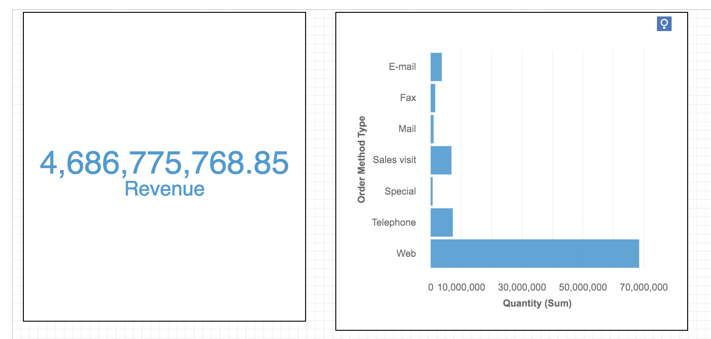
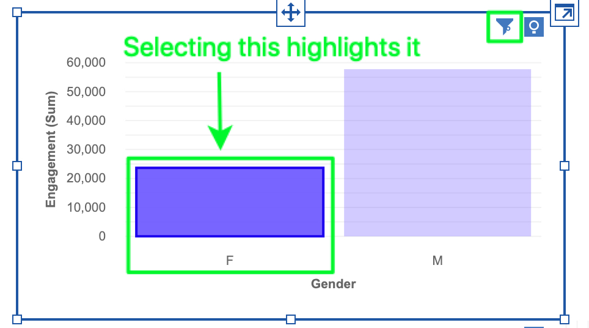
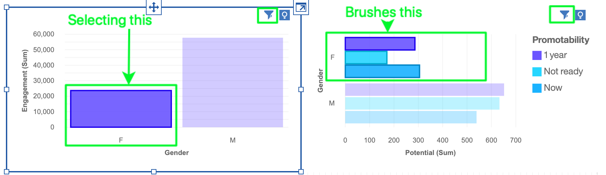
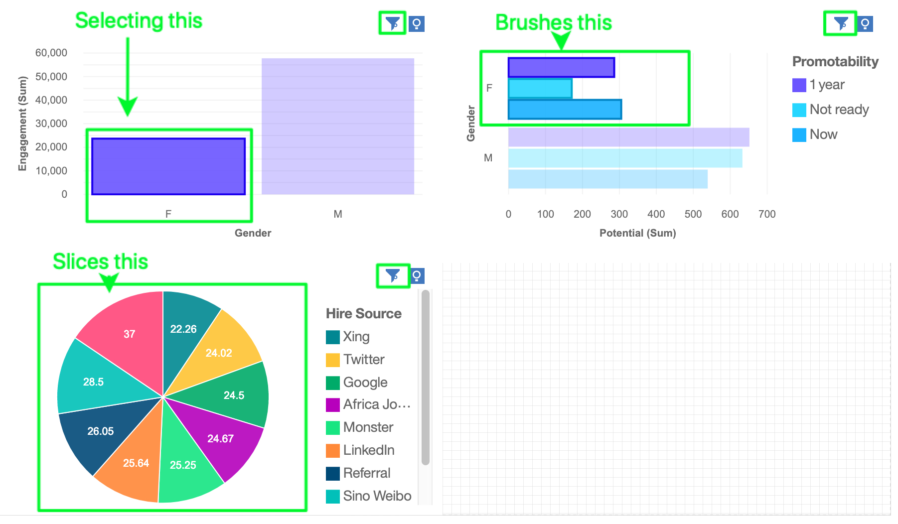
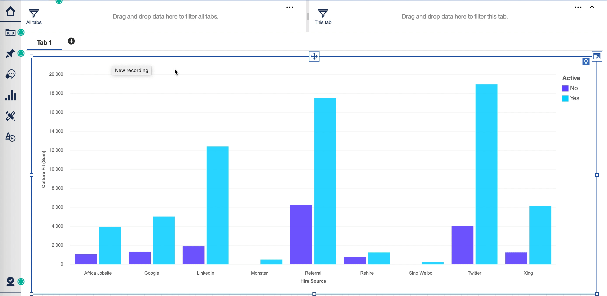

# Selection

**Selection** is a concept that refers to three types of filtering in Dashboard; **Highlighting**, **Brushing**, and **Slicing**.  In short, Selection pertains to **filtering based on what the user selects on a visualization**. Selection allows users to have their dashboard update to reflect what they have chosen to see without having to apply a filter in a traditional menu. Because you are working with data, selection can be influenced by data joins (automatic and/or user-defined) and a Dashboard feature we informally call 'joins-but-not-joins'.

This code introduction will provide you with an overview of:
1. Important concepts  
1.1 Projected values vs. non-projected values  
1.2 Highlighting  
1.3 Brushing  
1.4 Slicing  
1.5 Lasso selection  
1.6 Edge selection vs point selection  
1.7 Data joins (automatic and user-defined)  
1.8 Joins-but-not-joins 
2. Primary use cases
3. Important Classes
4. Important Functions
5. Known limitations as of 11.1 R2

## 1. Important concepts
### 1.1 Projected vs. non-projected
* A _projected_ value is essentially **what is being shown on a visualization**. The items that you drag into the data slot are projected items. Projected values are data elements of a visualization that are visible to a user, such as an axis label, a bar on a Bar visualization, etc.
* A _non-projected_ value is data that is not represented by any visualization element, but is indirectly represented or influencing what appears on a visualization.  
**Example**


On the Bar chart, both Order Method Type and Quantity are projected values. On the Summary widget, Revenue is the projected value. Order Method Type is a non-projected value for the Summary widget because it does not appear directly on the visualization.

### 1.2 Highlighting
* Highlighting refers to **the effect of a user's selection on the visualization where they performed that selection; the element(s) a user selected appears 'highlighted' while all others are faded out**
* Highlighting is a means of drawing one's attention to one or more data elements of a visualization that a user has selected
* A user can make selection on a point or an edge. "Point" doesn't refer to only a point on the Point visualization type; it refers to any point on any visualization, such as a bar on a Bar, or a bubble on a Bubble.  
**Example**  


➡ In this Column visualization, the projected points are 'Gender' 'F' and 'M'. The column 'F' has been selected and appears highlighted, while 'M' is still visible but in the background.   
➡ NOTE: The filter indicator appears in the top right of the widget to indicate a filter is applied to this visualization.

* Highlighting is different from traditional filters for two primary reasons:  
➡ Rather than data being filtered out entirely, all data visualization elements are still present, but what a user has selected appears highlighted as to draw attention to it  
➡ You can dismiss your highlight by clicking on something else on the visualization (either blank space to dismiss all highlighting, or on another element to perform a different highlight)    

A highlight can be performed on:  
➡ a visualization point (eg. a single bubble on a Bubble vis)  
➡ multiple visualization elements (eg. two or more bubbles on a Bubble vis)  
➡ a categorical item in a legend  
➡ multiple categorical items in a legend  
➡ a visualization edge (eg. a column of a Table)  
➡ multiple visualization edges (eg. two or more columns of a Table)   

### 1.3 Brushing
* Brushing refers to the effect a selection of a shared projected value on one visualization has on another visualization. **When a user highlights a point or edge of on one visualization, it will 'brush' across the dashboard canvas and highlight all other visualizations using that same projected value.** Brushing is a filter on a shared projected value.  
**Example**


➡ As a continuation of the Highlighting example, both the Column and Bar visualizations have been created from the same table of the same source. Both have the column 'Gender' projecting the values 'F' and 'M'  
➡ When the column 'F' is selected on the Column visualization, the selection of 'F' will brush across the dashboard canvas, and highlight all other visualization projecting the value 'F'. On the Bar visualization, the three bars representing 'F' as coloured by the three categories of 'Promotability' are highlighted.   
➡ NOTE: The filter indicator in the top right of both widgets to indicate a filter is applied to both visualizations.

### 1.4. Slicing
* Slicing refers to the effect a selection of a visualization element on one visualization has on another visualization when there are shared non-projected values, but no shared projected values. **A selection ‘slices values’ on visualizations where the value is not projected.** Slicing is a filter on a non-projected value.  
**Example**   


➡ As a continuation of the Highlighting and Brushing examples, a Pie visualization has been created from the same table of the same source as the Column and Bar visualizations. The Pie is _not_ projecting the values 'Gender' 'F' and 'M'. The Pie visualization is projecting 'Hire source' and 'Attrition risk'  
➡ When the column 'F' is selected on the Column visualization, the selection of 'F' will brush across the dashboard canvas, and highlight the Bar visualization because it projecting the value 'F'. The Pie visualization not projecting 'F', so in response to the selection on 'F', we will slice the Pie visualization to show only the data from the columns 'Hire source' and 'Attrition risk' that are related to 'Gender' 'F'.   
➡ NOTE: The filter indicator appears in the top right of all three widgets to indicate a filter is applied to all visualizations.   

* The widget will need to query the data, because it doesnt have it. For example, a summary chart displaying total revenue would have to query in order to display web revenue. 

Here is the query string parameters in the case when a user makes a selection that highlights, brushes, and slices:
```
{
  "version": "1",
  "dataItems": [
    {
      "id": "id1921552814",
      "itemId": "My_Data_csv.Hire_Source"
    },
    {
      "id": "id137595098",
      "itemId": "My_Data_csv.Attrition_Risk",
      "aggregate": "avg",
      "selection": [
        {
          "operation": "order",
          "sort": {
            "type": "asc",
            "priority": 1
          }
        }
      ]
    }
  ],
  "projections": [
    "id1921552814",
    "id137595098"
  ],
  "limit": 3000,
  "filters": [
    {
      "type": "pre",
      "expression": {
        "operator": "in",
        "values": [
          "My_Data_csv.Gender->[F]"
        ],
        "itemId": "My_Data_csv.Gender"
      }
    }
  ],
  "queryHints": {
    "preferredModelItems": [
      "My_Data_csv.Gender",
      "My_Data_csv.Engagement",
      "My_Data_csv.Potential",
      "My_Data_csv.Promotability"
    ]
  }
}
```

Here is how a selection that highlights, brushes, and slices appears in the board specification:
``` 
},
    "pageContext": [
        {
            "origin": "visualization",
            "table": "",
            "alias": "0",
            "sourceId": "model000001689b412231_00000002",
            "hierarchies": [
                {
                    "hierarchyUniqueName": "My_Data_csv.Gender"
                }
            ],
            "scope": "model000001689b4121ae_00000000",
            "hierarchyUniqueNames": [
                "My_Data_csv.Gender"
            ],
            "eventSourceId": "model000001689b416513_00000000",
            "eventGroupId": "model000001689b4121ae_00000000:1",
            "tupleSet": "{\"My_Data_csv.Gender->[F]\":[{\"u\":\"My_Data_csv.Gender->[F]\",\"d\":\"F\"}]}"
        }
 ]
```

### 1.5 Lasso selection

The 'Select tool' option (aka. 'lasso selection') in the on-demand-toolbar (ODT) that provides users with the option to **quickly and easily highlight multiple points on their visualization.** The interaction involves a click, drag over the visualization elements you wish to highlight, and release.  

The result a user will see is multiple parts of a visualization highlighted, and the highlighting will behave the same as if a user were to perform a multi-selection that brushes and/or clices other visualizations. Users can have multiple lasso selections at once.  
**Example**  


### 1.6 Edge selection vs point selection  
* Remember those tables you see sometimes where you click on the column label at the top, and the entire column selects? Thats an example of an edge selection. Whereas clicking on a specific cell in that table would be an example of a point selection.
* Another example of an edge selection is selecting a member in a bar chart with color. Another example of point selection is selecting a point in a scatter chart.   
➡ NOTE: Clicking on a bar in a bar chart is a point selection. Why? Because the bar in any bar chart actually represents one point (the height of the bar). It's a bit tricky to see this because of how bar charts are displayed visually.

### 1.7 Data joins (automatic and user-defined)

Dashboard relies on the MOSER and MUI components (MOSER, Smart modelling, & Modeller UI) to import, classify, and make data available so it can be consumed in the Dashboard perspective. 

_User-defined joins_ are [relationships a user can create themselves in a Data module](https://www.ibm.com/docs/en/cognos-analytics/11.2.0?topic=relationships-creating-relationship). Remember your SQL classes? Joins is essentially used to combine rows from 2 or more column or tables, based on a common attributes in each. **This is all done server side**. 

User-defined joins are powerful and provide users with a great degree of governance over their data. Despite their value, user-defined joins are often too complex for our business users to discover, create, and modify. A simpler solution was needed.

_Automatic joins_ is the new means to make joins more accessible to business users. In short, the Smart modelling service will identify data that a user would likely create a user-defined join relationship for and automatically create the relationship for them. 

By design, uses in Dashboard have little-to-no ability to tell when a column or table is part of a join relationships. Dashboard should refrain from implementing special case handling for data with join relationships, instead trying to remain as agnostic to the data type as possible.

Data joins will affect the selection experience in cases where a user has two or visualizations on the canvas that are sourced from different tables or sources that have joins defined. When a user performs a selection action on one visualization, the other visualizations will behave as though they are from the same source and you will see values be brushed or sliced.

### 1.8 Joins-but-not-joins
* Joins-but-not-joins is our silly name for a feature that makes data from different tables and/or sources to behave as though it is joined when working in a Dashboard. Joins-but-not-joins takes effect automatically when a user has two or more tables and/or sources that have column headers with the exact same name (case insensitive).  
* Joins-but-not-joins **allows users to make selections on visualizations created from different tables and/or sources and they will highlight, brush, and slice as though they were created from the same table.**  
* This feature works in conjunction with MUI automatic joins and takes the work out of having to create join relationships in the simple cases where column headers match exactly.  
* For example, if you have two files with a Column "year" and you add these files to your Dashboard, and create charts, filters, etc with both "Years" involved, this is joins-but-not-joins. In the sense that it is indeed a join, but its not done within a data module, so parts of it are done client side.  
**Example**  
   
➡ In this example above you are viewing the metadata tree for an Excel file that has two sheets. These sheets are different tables 'Table 1' and 'Table 2'. You'll notice that both tables have columns called 'Company', 'Donation', 'Country' and 'Region'. If you were to create a visualization from columns in 'Table 1' and a second vis from 'Table 2', and then perform a selection on a point on one visualization, it will brush, and slice the other vis as though they were created from the same table.
